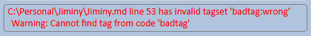
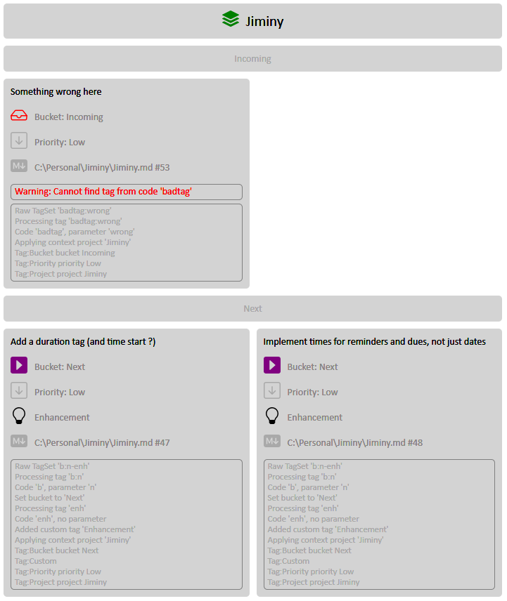

# Jiminy
=ctx-prj:Jiminy-docu=

## Overview
A custom to-do system that watches MarkDown files in a set of nominated directories, scans through new and changed ones to gather custom tags from an expandable GTD-esque set, combines them and generates one or more highly configurable static HTML and/or JSON outputs from templates.

## Why
Over the years I've used numerous systems to organise the things I needed to do, such as EverNote, OneNote, BoostNote and a few others, mainly trying to shoehorn in a personalised version of the GTD system into a host that seemed to prefer that I didn't.

While they are all capable, pretty and/or useful in their own ways, I found each to be variously annoying, bloated, awkward, tying me into their way of working, or otherwise not ideal.

I want something that is very simple and quick to add items to, where I can just dump  a note, reminder or other to-do item that I need to be nudged about into whatever I'm typing into, then via some unbidden sorcery find them all in one place in a nice structure that helps me prioritise and schedule getting on with them.

I also want something that can be backed up easily, where the backups are easily readable and greppable, and be selectively restored or the content copy-pasted; not an obscure .unreadablebymerehumans format that I won't be able to open in 10 years.

Since I use MarkDown for making notes anyway, and a lot of my to-dos in other systems just referenced those .md files (or worse, duplicated chunks of them), I figured why not just add the to-do items (I'll just call them 'items' hereafter) directly to the MarkDown in such a way that they can be easily recognised and dug out by software.

So my solution is to go back to good old text files in directories for my to-do system, rather like the method I used back in the Cambrian era, namely having a 'todo.txt' in each folder.

This time though, there is a system that gathers all the items into one place, reminds me about things and makes it easy to work out what's important while keeping a complete set of everything I want to get done during my next two or three lifetimes.

## Acknowledgements
The delicious CSS-only tabs were gleefully lifted from [Code Convey](https://codeconvey.com/simple-css-tabs-without-javascript/), it's an impressively smooth and good-looking implementation that handles any number of tabs without a hint of JavaScript or external dependency.

The SVG files that it uses are taken from the [Bootstrap icon collection](https://icons.getbootstrap.com/?#icons).

## Example of use

The idea is that I can keep using my favourite Markdown editor (the splendid [GhostWriter](https://wereturtle.github.io/ghostwriter/), but any will do) to make notes and draft documents but when I need to remind myself of something, I add a line such as;

```
 =b:n-p:2-prj:Jiminy-enh-pho= Call Fred about making it do XYZ in a better way
```

..and continue typing without breaking my stride to open up EverNote, click a button to create a new note, find that it now asks me what type of note, oh, that's new, no I don't want a task thanks, hit new note again, type in the title, tab and add the text, then add 5 different tags to make it a priority 2 'next' enhancement in the Jiminy project that involves a phone call, remember yet again that there isn't a save button to press, then switch back to the document I'm writing and try to remember what I was planning to write next.

This way I have no context switching or little surpises when EverNote decides it'd be just spiffing to add a new feature I don't want into a well-established workflow, I just keep typing and Jiminy tells me what I need to remember later.

## Tags overview
Tags are the way you tell Jiminy everything about an item. There will be a full explanation of each standard tag and how to add custom ones somewhere below this section but as a brief introduction to how it works, take the example from above, namely;

``` 
 =b:n-p:2-enh-pho= Call Fred about making it do XYZ in a better way
```

Tags start and end with a selected string, by default both are '=' as they seem unused by Markdown but they could be any characters or strings; say '>=>' and '<!=' or 'tagstart' and 'tagend' if you prefer.

Tags are separated by hyphens and parameters are delimited by colons but again, any strings can be defined instead. I chose these because they easily typed without pressing shift and visually separate the tags nicely.

The default definitions are;

```
"TagSettings": {
    "Prefix": "=",
    "Suffix": "=",
    "Separator": "-",
    "Delimiter": ":",
    ...etc...
```

 This tag set is interpreted as;

|Tag|Short for|Meaning|
|-|-|-|
|b:n|bucket:next|This item goes into the 'Next' GTD bucket; aka 'GTD list', but I prefer bucket, you can customise the settings to make them be called lists if you like.|
|p:2|priority:2|Priority 2 item, this could have been 'p:med', 'pri:medium' etc. Priorities can be indicated by number or name, you can redefine the priority list as you like but by default there are 1, 2 & 3 for high, medium and low.|
|enh|enhancement|Custom tag to indicate an enhancement, you can have as many custom tags as you like and add a custom icon and colouring for each.|
|pho|phone|Custom tag to indicate this item needs a phone call to get done. You can have it make lists of specific tags so for example could have a list of all the phone calls you need to make, or all items that require you to be in a specific place to do. Essentially the GTD 'context' concept.|

This tag set results in a display in the output HTML along the lines of;


Tags must begin as character 1 on the line, the system only looks for the starting prefix there, at present anyway. 

Trying to interpret everything following an '=' found anywhere in a file as an item doesn't sound entirely wise, so there would clearly need to be more distinct delimiters, and it'd slow things down a fair bit of course.

The examples above have a sneaky space in front of them to stop them messing up my Jiminy output with reminders to call Fred. That preceding space makes them be ignored.

## Item text
All the text after the suffix, until the end of the line, is added to the item as the associated text. This text is displayed at the top of each item in the output.

The text is added raw and as-is, so can include valid html, or invalid html for that matter; it's entirely up to your browser what it makes of it.

As such, the below results in what you'd expect it to.

```
 =b:n-enh= Do these things;<ul><li>Thing 1</li><li style='color:blue'><b>Thing 2</b></li></ul>
```

Please note that failing to terminate an element, eg. leaving off the '\</ul>' in the above would not be caught by the parser, at least currently. This may well have some impact on the readability of the subsequent output ;).

=b:may-enh= Provide a way to tell it to take the next line, or next N lines as part of the associated text.<br>Maybe with a new 'end of text' delimiter N lines further down to tell it where to stop.

## Tag Context
To avoid having to add the project or any other frequently used tag to each item, it's best to set that as a context, so adding;

```
 =p:Jiminy-setctx= 
```

..earlier in the file tells it to set the context that all subsequent items in this source file are for project 'Jiminy', so for the rest of the document I don't need to tell it which project items are for. You can set a context with 'setcontext', or the synonym 'ctx'.

You could then override the context for a specific item, change the context to another project or clear the context entirely with 'clearcontext', 'clear' or 'xctx', the default synonyms for the 'ClearContext' tag.

You can use any set of tags as a context, so;

```
 =setcontext-prj:Jiminy-b:wait-enh-pri:low-rem:3/nov-due:10/dec=
```

..would give every subsequent item tags for project 'Jiminy', bucket 'Waiting', priority 'Low', mark it as an enhancement, set a reminder for the 3rd of November and a due date of 10th December.

You can use the full tag name, eg 'bucket:\[bucket name]' or any synonym that you set up, by default 'b' is a synonym for 'bucket'. Similarly, the 'Project' tag has a synonym of 'prj' but you can easily have 'p' as the synonym for project instead of priority.

This document has a context setter at the beginning to set the context for items I want to remind me about things to do with the document, namely;

```
=ctx-prj:Jiminy-docu=
```

So all items I add in here are put in my 'Jiminy' project, and marked as relating to documentation.

## Tag names & synonyms

All the tag names and the synonyms for them are customisable. The default settings fragment below shows you can add a tag to mark an item as complete with 'completed', 'closed' or 'x'. Bucket has a synonym of 'b' and priority 'p' or 'pri', you can have as many synonyms as you like.

On startup, if any names or synonyms clash, it will complain and refuse to run.

```
"TagSettings": {
	...blah...
    "Defintions": {
      "Items": [
        {
          "GenerateView": false,
          "Synonyms": [
            "closed",
            "x"
          ],
          "Code": "completed",
          "IsCustomTag": false,
          "IsStandardTag": true,
          "Name": "Completed",
          "IconFileName": "completed.svg",
          "Colour": null,
          "DisplayOrder": 1,
          "Description": "This item is completed"
        },
        {
          "Type": 5,
          "GenerateView": true,
          "Synonyms": [
            "b"
          ],
          "Code": "bucket",
          "IsCustomTag": false,
          "IsStandardTag": true,
          "Name": "Bucket",
          "IconFileName": "bucket.svg",
          "Colour": null,
          "DisplayOrder": 3,
          "Description": "This item is in a bucket (in, next, waiting, maybe)"
        },
        {
          "Type": 2,
          "GenerateView": true,
          "Synonyms": [
            "p", "pri"
          ],
          "Code": "priority",
          "IsCustomTag": false,
          "IsStandardTag": true,
          "Name": "Priority",
          "IconFileName": "priority-medium.svg",
          "Colour": null,
          "DisplayOrder": 3,
          "Description": "The priority of this item"
        }
        ...etc...
```

## Source files
By default it only looks at '*.md' files but you can tell it to look in any files you like, according to the settings fragment below. Currently you can only have one file specification per directory, but can have multiple entries for a directory with a different file specification for each.

=b:eve-enh= Make IncludeFileSpecification a list, set up a watcher for each.

```
"MonitoredDirectories": [
    {
      "Recursive": true,
      "IncludeFileSpecification": "*.md",
      "IsActive": true,
      "Path": "C:\\Personal"
    },
    {
      "Recursive": true,
      "IncludeFileSpecification": "*.md",
      "IsActive": false,
      "Path": "C:\\Development"
    }
  ],
  ...etc...
```

## Output files
You can have any number of HTML and/or JSON output files, filtered on lists of project names or tags. 

The HTML files use a .HTML template file and insert the generated content into it. You can completely customise the templates with whatever styling you like.

For example you might just want one overall HTML output for all items, or have a second output for a specific project, perhaps plus another just for bugs and enhancement requests, another for all reminders and items with due dates or another with just items relating to a specific client which you can send to them.

I'll add more filtering criteria but with existing functionality its easy to just add a new custom tag 'PutInOutputForFred', tag a bunch of items with it and define a new output that only includes items with that tag.

Each output can use either the standard HTML template or a specific template just for that output.

I wanted a system where the output is entirely portable and could be viewed or copied anywhere, emailed to somebody, chucked onto a phone etc. so the HTML is completely self-contained in a single file, not dependent on any external files or internet connection. 

The CSS is completely in-line and the icons are SVGs which are read in on startup, included in the file as HTML statements and customised for their base size and colour at output generation time.

At the time of writing, it doesn't use any JavaScript.

```
"HtmlSettings": {
    "ShowDiagnostics": false,
    "VerboseDiagnostics": false,
    "HtmlTemplateFileName": "C:\\Personal\\Jiminy\\HtmlTemplate.html",
    "Outputs": [
      {
        "IsEnabled": true,
        "Title": "All Items",
        "HtmlPath": "C:\\Personal\\Jiminy\\Output.html",
        "OverrideHtmlTemplateFileName": null,
        "ItemSelection": null
      },
      {
        "IsEnabled": false,
        "Title": "Jiminy Items",
        "HtmlPath": "C:\\Personal\\Jiminy\\Jiminy.html",
        "JsonPath": "C:\\Personal\\Jiminy\\Jiminy.json",
        "OverrideHtmlTemplateFileName": null,
        "ItemSelection": {
          "MustMatchAll": false,
          "IncludeTagNames": [],
          "IncludeProjectNames": [
            "Jiminy"
          ]
        }
      },
```

### Customising the output
The template HTML file mainly consists of two \<style> statements, the second is purely for the tabs so can be altered but with care. The tremendous CSS-only tab code was cheerfully robbed from [Code Convey](https://codeconvey.com/simple-css-tabs-without-javascript/).

The first \<style> section contains all the styling that applies to the item content, and can be tweaked to your heart's content. 

The HTML within the \<body> element  is generated entirely by code and is inserted into the template where it finds '[ContentPlaceholder]'.

The generated HTML uses classes everywhere to allow extra customisation. You can add more HTML around the placeholder to slot the output into a larger document, or whatever.

Below is the \<body> section of the default template;

```
...head stuff...
</head>
<body>

    <!--The placeholder below will be replaced by the content, feel free to add any custom content around it-->
    [ContentPlaceholder]

</body>
</html>
```

If the item data needs to be played with more extensively you can always use the JSON output instead.

### JSON output

The JSON file outputs aren't configurable other than filtering which items are written, you just get a standard (indented so human-readable) .JSON with all the item and tag information.

=b:next-bug= Don't write diagnostics to JSON output if ShowDiagnostics setting is false

```
{
  "Items": [
    {
      "AssociatedText": "",
      "SetsContext": true,
      "SourceLineNumber": 42,
      "FullText": "=prj:Jiminy-ctx=",
      "SourceFileName": "C:\\Personal\\Jiminy\\Jiminy.md",
      "Warnings": [],
      "Diagnostics": [
        "Processing tag \u0027prj:Jiminy\u0027",
        "Code \u0027prj\u0027, parameter \u0027Jiminy\u0027",
        "Setting project to \u0027Jiminy\u0027",
        "Processing tag \u0027ctx\u0027",
        "Code \u0027ctx\u0027, no parameter",
        "Set context: Repeat:, Pri:, Bucket:, Project:Jiminy, Text:, File:",
        "Setting context"
      ],
      "CreatedUtc": "2021-09-02T02:35:49.9839061Z",
      "BucketName": "Incoming",
      "ProjectName": "Jiminy",
      "PriorityName": "Low",
      "PriorityNumber": 3
    },
    {
      "AssociatedText": "Implement delete clearing tags",
      "SourceLineNumber": 43,
      "FullText": "=b:eve-enh= Implement delete clearing tags",
      "SourceFileName": "C:\\Personal\\Jiminy\\Jiminy.md",
      "Warnings": [],
      "Diagnostics": [
        "Processing tag \u0027b:eve\u0027",
        "Code \u0027b\u0027, parameter \u0027eve\u0027",
        "Set bucket to \u0027Eventually\u0027",
        "Processing tag \u0027enh\u0027",
        "Code \u0027enh\u0027, no parameter",
        "Added custom tag \u0027Enhancement\u0027",
        "Applying context project \u0027Jiminy\u0027"
      ],
      "CreatedUtc": "2021-09-02T02:35:49.9839307Z",
      "BucketName": "Eventually",
      "ProjectName": "Jiminy",
      "PriorityName": "Low",
      "PriorityNumber": 3
    },
    {
      "AssociatedText": "Open Ghostwriter from Jiminy.html",
      "SourceLineNumber": 44,
      "FullText": "=b:eve-enh= Open Ghostwriter from Jiminy.html",
      "SourceFileName": "C:\\Personal\\Jiminy\\Jiminy.md",
      "Warnings": [],
      "Diagnostics": [
        "Processing tag \u0027b:eve\u0027",
        "Code \u0027b\u0027, parameter \u0027eve\u0027",
        "Set bucket to \u0027Eventually\u0027",
        "Processing tag \u0027enh\u0027",
        "Code \u0027enh\u0027, no parameter",
        "Added custom tag \u0027Enhancement\u0027",
        "Applying context project \u0027Jiminy\u0027"
      ],
      "CreatedUtc": "2021-09-02T02:35:49.9839648Z",
      "BucketName": "Eventually",
      "ProjectName": "Jiminy",
      "PriorityName": "Low",
      "PriorityNumber": 3
    },
    ...etc...
```

### Output generation speed
It will spot changed or created files in the monitored directories immediately and get to work on them within a second or two, so the output should be regenerated within a second or three unless it's a gargantuan file or has hundreds of items, I've not tested it with any monster files yet but it should be pretty snappy.

Currently the code is half event based and half timer based, I need to clear that up so it's entirely event based.

=p:1-b:n-enh= Ditch the timer loop in the monitor.

There is a LatencySeconds setting that is intended to make it hang back for a second or few so as to allow for somebody saving a file repeatedly in a short period and not have Jiminy regenerate the output every single time.

## Reminders and Due dates
=b:n= Document reminders and dates, screenshots etc.

## Icons & Colours
Each tag and some properties within tags can have an icon associated with them, for example each priority level can have a different icon. The icons are all configurable, or you can dispense with them entirely.

The icons must be SVG files, the reason being that they are read in by the system and added to the output in html format, so the SVG files are not needed to view the output, just when it is generated.

The SVG files are stored in a local directory indicated by the MediaDirectoryPath setting and named in the settings.

The system sets the fill colour of the icons according to the properties of the item, so for example in the standard settings, the icon for high priority items is automatically filled with colour 'orange' but filled with 'darkgrey' for medium and low priority, see the relevant settings fragment below.

Colours are identified by the standard [CSS colour names](https://www.w3schools.com/cssref/css_colors.asp), so any valid CSS colour name is supported, or you can supply a hex value.

```
"TagSettings": {
    ...blah...
    "Defintions": {
      "Items": [
        {
          "GenerateView": true,
          "Synonyms": [
            "p"
          ],
          "Code": "priority",
          "IsCustomTag": false,
          "IsStandardTag": true,
          "Name": "Priority",
          "IconFileName": "priority-medium.svg",
          "Colour": blue,
          "DisplayOrder": 3,
          "Description": "The priority of this item"
        },
		...etc...

```
...and...
```
"PrioritySettings": {
    "Defintions": {
      "Items": [
        {
          "Number": 1,
          "Name": "High",
          "IconFileName": "priority-high.svg",
          "Colour": "orange",
          "DisplayOrder": 0,
          "Description": ""
        },
        {
          "Number": 2,
          "Name": "Medium",
          "IconFileName": "priority-medium.svg",
          "Colour": "darkgrey",
          "DisplayOrder": 0,
          "Description": ""
        },
        {
          "Number": 3,
          "Name": "Low",
          "IconFileName": "priority-low.svg",
          "Colour": "darkgrey",
          "DisplayOrder": 0,
          "Description": ""
        }
      ]
    }
  },
```

## Errors & Diagnostics
If you give it a tag or parameter that it doesn't recognise, it will report it right at the top of the HTML output where you can't miss it, so;

```
 =badtag:wrong= Something wrong here
```
..will result in..



If you can't work out what you're doing wrong with a tag, turn on diagnostics;
```
"HtmlSettings": {
    "ShowDiagnostics": true,
    "VerboseDiagnostics": false,
    "HtmlTemplateFileName": "C:\\Personal\\Jiminy\\HtmlTemplate.html",
    ..etc..
```

...and each item display will include a full report of what it did when interpreting each tag set and the tags it decided to apply, as below.



Note that even though the tag on 'Something wrong here' wasn't valid, it still creates an item and warns that it's not tagged properly.

## Console application
Currently it runs from a Windows console, you can see activity and progress messages displayed there. 

At some point when it stabilises I may write a service shell for it, so it runs as a Windows service but for now it's not really a priority.

=b:eve-enh:p:low= Implement Jiminy as a Windows service

## Updating source tags from the HTML display
There is no updating of the source tags from the HTML. You must go to the source file, change it there and refresh the browser to see the regenerated HTML file.

The name of the source file and the line number the tag was found on are shown for each item. 

Having an HTML page writing to local files is theoretically not possible or at least philosophically unthinkable, and even I were to wangle some kind of hack to get around this, having it write back to the source files is fraught with problems; apart from anything else the source file may well be open in a MarkDown editor and the changes would just get overwritten.

The upshot being that there is no "This item is completed", "Move this to the waiting bucket" or "Set a reminder for tomorrow" functionality in the HTML output.

At some point I might put a WPF front end on it, then might revisit that decision but probably not, there would still be the problem of the changes being overwritten.

Perhaps a JavaScript button could pop up a dialogue where changes were made and the the changed tag text put the clipboard so it could be pasted into the Markdown. That would save some typing, but at the cost of clicking checkboxes, selecting from dropdowns etc. which would be slower and more disruptive to the 'flow'. The main problem is getting to the correct line in the source file to make the change and it wouldn't help with that.

I was thinking of having a JavaScript button that just hides an item, or moves it to a 'Hidden' tab. It'd just reappear when the browser refreshes but, could be good for popping off items and marking dailies as done

How much use this would be depends on how often the output gets refreshed, though perhaps it could store the id of each hidden item in browser local storage or something and re-hide them on refresh if the source tags hadn't changed.

=b:maybe-enh= Button to temporarily move an item to a 'Hidden' tab.
=b:n-enh= Generate a unique id for each item from hash of full file path and line number, use as html element name on each item card, for use in hiding items and whatever else.

## Configuration file
Everything is defined in a fairly large appsettings.json file in the directory the program runs from.

Initially there is no such file, the first time Jiminy runs it will create a default version of it and then fail spectacularly because it has no idea what your directories are called. You can then customise the settings as you wish.

If you ever need to regenerate the default appsettings.json, delete or rename the existing one and restart Jiminy.

## Synchronising between machines
One of the benefits of EverNote, OneNote etc is the way they synchronise between PC, Laptop, phone etc. 

The thing is though, I work almost exclusively from a single desktop machine and occasionally use a laptop when I am dragged kicking and screaming from my office, so that's not really a big issue for me.

Since this is all based on good old text files, it would be easy to use a file synching tool to do the job or store the files in a DropBox folder, or whatever.

## Sample appsettings.json

There's a lot of stuff in here, most of which can happily be left alone but if delved into, allows you to alter a lot of things about how it interprets tags it finds in source files and what output it produces.

The main one to start with is the 'MonitoredDirectories' settings.

I've set the json serialiser to include all values in the below and the default file that is created, it makes for a rather larger file but is much easier to see what options are available if all the defaults are shown too.

A good deal of additional documentation is required here...

=b:eve-pri:low-docu= Document each setting... at some point.

```JSON

{
  "LatencySeconds": 10,
  "MediaDirectoryPath": "C:\\Personal\\Jiminy\\Media",
  "TagSettings": {
    "Prefix": "=",
    "Suffix": "=",
    "Seperator": "-",
    "Delimiter": ":",
    "Defintions": {
      "Items": [
        {
          "Type": 9,
          "GenerateView": false,
          "Synonyms": [
            "closed",
            "x"
          ],
          "Code": "completed",
          "IsCustomTag": false,
          "IsStandardTag": true,
          "Name": "Completed",
          "IconFileName": "completed.svg",
          "Colour": null,
          "DisplayOrder": 1,
          "Description": "This item is completed"
        },
        {
          "Type": 10,
          "GenerateView": false,
          "Synonyms": [
            "url"
          ],
          "Code": "link",
          "IsCustomTag": false,
          "IsStandardTag": true,
          "Name": "Link",
          "IconFileName": "link.svg",
          "Colour": "blue",
          "DisplayOrder": 2,
          "Description": "A link to a URL"
        },
        {
          "Type": 5,
          "GenerateView": true,
          "Synonyms": [
            "b"
          ],
          "Code": "bucket",
          "IsCustomTag": false,
          "IsStandardTag": true,
          "Name": "Bucket",
          "IconFileName": "bucket.svg",
          "Colour": null,
          "DisplayOrder": 3,
          "Description": "This item is in a bucket (in, next, waiting, maybe)"
        },
        {
          "Type": 2,
          "GenerateView": true,
          "Synonyms": [
            "p"
          ],
          "Code": "priority",
          "IsCustomTag": false,
          "IsStandardTag": true,
          "Name": "Priority",
          "IconFileName": "priority-medium.svg",
          "Colour": null,
          "DisplayOrder": 3,
          "Description": "The priority of this item"
        },
        {
          "Type": 6,
          "GenerateView": true,
          "Synonyms": [
            "prj"
          ],
          "Code": "project",
          "IsCustomTag": false,
          "IsStandardTag": true,
          "Name": "Project",
          "IconFileName": "project.svg",
          "Colour": "green",
          "DisplayOrder": 3,
          "Description": "This item relates to a project"
        },
        {
          "Type": 4,
          "GenerateView": true,
          "Synonyms": [],
          "Code": "due",
          "IsCustomTag": false,
          "IsStandardTag": true,
          "Name": "Due",
          "IconFileName": "due.svg",
          "Colour": null,
          "DisplayOrder": 4,
          "Description": "There is a due date for this item"
        },
        {
          "Type": 3,
          "GenerateView": true,
          "Synonyms": [
            "r"
          ],
          "Code": "reminder",
          "IsCustomTag": false,
          "IsStandardTag": true,
          "Name": "Reminder",
          "IconFileName": "reminder.svg",
          "Colour": null,
          "DisplayOrder": 5,
          "Description": "There is a reminder for this item"
        },
        {
          "Type": 7,
          "GenerateView": false,
          "Synonyms": [],
          "Code": "repeating",
          "IsCustomTag": false,
          "IsStandardTag": true,
          "Name": "Repeating",
          "IconFileName": "repeating.svg",
          "Colour": null,
          "DisplayOrder": 6,
          "Description": "This item repeats"
        },
        {
          "Type": 8,
          "GenerateView": false,
          "Synonyms": [
            "context",
            "ctx",
            "setctx"
          ],
          "Code": "setcontext",
          "IsCustomTag": false,
          "IsStandardTag": true,
          "Name": "SetContext",
          "IconFileName": null,
          "Colour": null,
          "DisplayOrder": 7,
          "Description": "An abstract property that sets the context of subsequent tags"
        },
        {
          "Type": 11,
          "GenerateView": false,
          "Synonyms": [
            "clear",
            "xctx"
          ],
          "Code": "clearcontext",
          "IsCustomTag": false,
          "IsStandardTag": true,
          "Name": "ClearContext",
          "IconFileName": null,
          "Colour": null,
          "DisplayOrder": 7,
          "Description": "An abstract property that sets the context of subsequent tags"
        },
        {
          "Type": 1,
          "GenerateView": true,
          "Synonyms": [],
          "Code": "bug",
          "IsCustomTag": true,
          "IsStandardTag": false,
          "Name": "Bug",
          "IconFileName": "bug.svg",
          "Colour": null,
          "DisplayOrder": 8,
          "Description": "Bug"
        },
        {
          "Type": 1,
          "GenerateView": true,
          "Synonyms": [],
          "Code": "enhancement",
          "IsCustomTag": true,
          "IsStandardTag": false,
          "Name": "Enhancement",
          "IconFileName": "enhancement.svg",
          "Colour": null,
          "DisplayOrder": 8,
          "Description": "Enhancement"
        },
        {
          "Type": 1,
          "GenerateView": true,
          "Synonyms": [],
          "Code": "conversation",
          "IsCustomTag": true,
          "IsStandardTag": false,
          "Name": "Conversation",
          "IconFileName": "conversation.svg",
          "Colour": null,
          "DisplayOrder": 9,
          "Description": "Talk to somebody"
        },
        {
          "Type": 1,
          "GenerateView": true,
          "Synonyms": [],
          "Code": "phonecall",
          "IsCustomTag": true,
          "IsStandardTag": false,
          "Name": "Phone call",
          "IconFileName": "phone.svg",
          "Colour": null,
          "DisplayOrder": 10,
          "Description": "Phone call required"
        },
        {
          "Type": 1,
          "GenerateView": false,
          "Synonyms": [],
          "Code": "question",
          "IsCustomTag": true,
          "IsStandardTag": false,
          "Name": "Question",
          "IconFileName": "question.svg",
          "Colour": null,
          "DisplayOrder": 10,
          "Description": "Question"
        },
        {
          "Type": 1,
          "GenerateView": false,
          "Synonyms": [],
          "Code": "videocall",
          "IsCustomTag": true,
          "IsStandardTag": false,
          "Name": "Video call",
          "IconFileName": "video-call.svg",
          "Colour": null,
          "DisplayOrder": 10,
          "Description": "Video call"
        }
      ]
    }
  },
  "LogSettings": {
    "VerboseConsole": true,
    "VerboseEventLog": false,
    "LogDirectoryPath": "C:\\Personal\\Jiminy\\Logs",
    "SqlConnectionString": null
  },
  "IgnoreFileSpecifications": [
    "readme.*",
    "README.*",
    "LICENCE.*"
  ],
  "MonitoredDirectories": [
    {
      "Recursive": true,
      "IncludeFileSpecification": "*.md",
      "Exists": true,
      "IsActive": true,
      "Path": "C:\\Personal"
    },
    {
      "Recursive": true,
      "IncludeFileSpecification": "*.md",
      "Exists": true,
      "IsActive": false,
      "Path": "C:\\Dev"
    }
  ],
  "BucketSettings": {
    "Defintions": {
      "Items": [
        {
          "Synonyms": [],
          "Name": "Incoming",
          "IconFileName": "inbox.svg",
          "Colour": "red",
          "DisplayOrder": 1,
          "Description": "The place where new items go when they have no home"
        },
        {
          "Synonyms": [],
          "Name": "Next",
          "IconFileName": "next.svg",
          "Colour": "purple",
          "DisplayOrder": 2,
          "Description": "Items to do next"
        },
        {
          "Synonyms": [],
          "Name": "Soon",
          "IconFileName": "soon.svg",
          "Colour": "blue",
          "DisplayOrder": 3,
          "Description": "Items to do soon"
        },
        {
          "Synonyms": [],
          "Name": "Waiting",
          "IconFileName": "waiting.svg",
          "Colour": "darkgrey",
          "DisplayOrder": 4,
          "Description": "Items that are waiting on other items or something else"
        },
        {
          "Synonyms": [],
          "Name": "Maybe",
          "IconFileName": "maybe.svg",
          "Colour": "green",
          "DisplayOrder": 5,
          "Description": "Items that may or may not end up happening"
        },
        {
          "Synonyms": [],
          "Name": "Eventually",
          "IconFileName": "eventually.svg",
          "Colour": "darkgrey",
          "DisplayOrder": 6,
          "Description": "Items to do eventually"
        }
      ]
    }
  },
  "PrioritySettings": {
    "Defintions": {
      "Items": [
        {
          "Number": 1,
          "Name": "High",
          "IconFileName": "priority-high.svg",
          "Colour": "orange",
          "DisplayOrder": 0,
          "Description": ""
        },
        {
          "Number": 2,
          "Name": "Medium",
          "IconFileName": "priority-medium.svg",
          "Colour": "darkgrey",
          "DisplayOrder": 0,
          "Description": ""
        },
        {
          "Number": 3,
          "Name": "Low",
          "IconFileName": "priority-low.svg",
          "Colour": "darkgrey",
          "DisplayOrder": 0,
          "Description": ""
        }
      ]
    }
  },
  "RepeatSettings": {
    "Defintions": {
      "Items": [
        {
          "NumberOfDays": 1,
          "NumberOfWeeks": 0,
          "NumberOfMonths": 0,
          "NumberOfYears": 0,
          "Name": "Daily",
          "IconFileName": "repeating.svg",
          "Colour": "red",
          "DisplayOrder": 1,
          "Description": "This item repeats daily"
        },
        {
          "NumberOfDays": 0,
          "NumberOfWeeks": 1,
          "NumberOfMonths": 0,
          "NumberOfYears": 0,
          "Name": "Weekly",
          "IconFileName": "repeating.svg",
          "Colour": "green",
          "DisplayOrder": 2,
          "Description": "This item repeats weekly"
        },
        {
          "NumberOfDays": 0,
          "NumberOfWeeks": 0,
          "NumberOfMonths": 1,
          "NumberOfYears": 0,
          "Name": "Monthly",
          "IconFileName": "repeating.svg",
          "Colour": "green",
          "DisplayOrder": 3,
          "Description": "This item repeats monthly"
        },
        {
          "NumberOfDays": 0,
          "NumberOfWeeks": 0,
          "NumberOfMonths": 0,
          "NumberOfYears": 1,
          "Name": "Yearly",
          "IconFileName": "repeating.svg",
          "Colour": "green",
          "DisplayOrder": 4,
          "Description": "This item repeats yearly"
        }
      ]
    }
  },
  "HtmlSettings": {
    "ShowDiagnostics": false,
    "VerboseDiagnostics": false,
    "HtmlTemplateFileName": "C:\\Personal\\Jiminy\\HtmlTemplate.HTML",
    "Outputs": [
      {
        "IsEnabled": true,
        "Title": "All Items",
        "HtmlPath": "C:\\Personal\\Jiminy\\Output.HTML",
        "JsonPath": null,
        "OverrideHtmlTemplateFileName": null,
        "ItemSelection": null
      },
      {
        "IsEnabled": true,
        "Title": "SingLink Items",
        "HtmlPath": "C:\\Personal\\Jiminy\\SingLink.HTML",
        "JsonPath": null,
        "OverrideHtmlTemplateFileName": null,
        "ItemSelection": {
          "MustMatchAll": false,
          "IncludeTagNames": [],
          "IncludeProjectNames": [
            "SingLink"
          ]
        }
      },
      {
        "IsEnabled": true,
        "Title": "Respondent Items",
        "HtmlPath": "C:\\Personal\\Jiminy\\Respondent.HTML",
        "JsonPath": null,
        "OverrideHtmlTemplateFileName": null,
        "ItemSelection": {
          "MustMatchAll": false,
          "IncludeTagNames": [],
          "IncludeProjectNames": [
            "Respondent"
          ]
        }
      },
      {
        "IsEnabled": true,
        "Title": "Bugs and Enhancements",
        "HtmlPath": "C:\\Personal\\Jiminy\\BugsEnhancements.HTML",
        "JsonPath": null,
        "OverrideHtmlTemplateFileName": "C:\\Personal\\Jiminy\\BugsEnhancementsTemplate.HTML",
        "ItemSelection": {
          "MustMatchAll": false,
          "IncludeTagNames": [
            "Bug",
            "Enhancement"
          ],
          "IncludeProjectNames": []
        }
      }
    ]
  }
}

```


