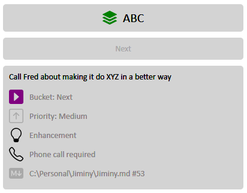

# Jiminy
=ctx-prj:Jiminy-docu=

## Overview
A custom TODO system that scans through .md files in a set of nominated directories, finds custom tags from an extended, and further extendable GTD-type set, combines and structures them and generates one or more static html and/or json outputs.

It watches a configurable set of directories, and re-scans and regenerates the outputs immediately when a new .md file is created or an existing one is updated.

## Why
Over the years I've used numerous systems to organise the things I needed to do, such as Evernote, OneNote, BoostNote and a few others, mainly trying to shoehorn in a personalised version of the GTD system into a host that seemed to prefer that I didn't.

While they are all capable, pretty and/or useful in their own ways, I found each to be variously annoying, bloated, awkward, tying me into their way of working, or otherwise not ideal.

I want something that is super-simple to add items to, where I can just dump in a note, reminder or other to-do item that I need to be nudged about, then find them all magically in one place in a nice structure that helps me prioritise and schedule getting on with them.

Since I use MarkDown for making notes anyway, and a lot of my to-dos in other systems referenced those .md files, I figured why not just add the to-do items (I'll call them 'items' from now) directly to the .md in a way that they can be recognised and dug out by something.

So, my solution is to go back to good old files in directories for my to-do system, like my old method of just having a 'todo.txt' in each folder, but now with MarkDown as the glue that holds everything together and a system that gathers it all in one place and highlights things that need it.

This means I can keep using my favourite Markdown editor (Ghostwriter, as it goes, but obviously any will do) to make notes and draft douments but when I need to remind myself of something, I just add something like;

```
=b:n-p:2-prj:ABC-enh-pho= Call Fred about making it do XYZ in a better way
```

..on a line on it's own and continue typing without breaking my stride to open up Evernote, create a new note, find it now asks me what type of note, oh, that's new, no I don't want a task thanks, hit new note again, type in the text, add 5 different tags to make it a priority 2 'next' enhancement in the ABC project that involves a phone call, remember yet again that there isn't a save button to press, then switch back to the document I'm writing and try to remember what I was going to write next.

## Tags overview
There will be a full explanation of each standard tag and how to add custom ones way below here, but as a brief introduction to how it works, take the example from above, namely;

``` 
 =b:n-p:2-enh-pho= Call Fred about making it do XYZ in a better way
```
Tags start and end with a selected string, by default both are '=' as they seem unused by Markdown, but they could be any characters, or strings; say '>=>' and '<!=' or 'tagstart' and 'tagend' if you prefer.

Tags are separated by hyphens and parameters are delimited by colons but again, any strings can be defined instead.

 This is interpreted as below;

|Tag|Short for|Meaning|
|-|-|-|
|b:n|bucket:next|This item goes into the 'Next' GTD bucket (aka list, I prefer bucket)|
|p:2|priority:2|Priority 2 item (or could have been p:med, pri:medium etc)|
|enh|enhancement|Custom tag to indicate an enhancement|
|pho|phone|Custom tag to indicate an phone call|

This results in a display in the output html along the lines of;


Tags must begin as character 1 on the line, the system only looks for them starting there; at present anyway. The examples above have a sneaky space in front of them to stop them messing up my Jiminy outputs with reminders to call Fred. That preceding space makes them be ignored.

## Contexts
To avoid having to add the project to each item, it's best to set that as a context, so adding;

```
 =p:ABC-setctx= 
```

..earlier in the file tells it to set the context that all subsequent items are for project ABC, so for the rest of the document I don't need to tell it which project items are for, but I could override the context for a specific item or clear the context with 'clear' or 'xctx'.

You can set any tag as a context, so;

```
 =ctx-prj:ABC-b:wait-enh-pri:low-rem:3/nov-due:10/dec=
```

..would set every subsequent item for project ABC, bucket 'Waiting', priority 'low', mark it as an enhancement and set a reminder for the 3rd of November and a due date of 10th December.

You can use the full tag name, eg 'bucket:\[bucket name]' or any synonym that you set up, I have a synonym of 'b' for bucket. Similarly, the 'Project' tag has a synonym of 'prj' but you can easily have 'p' as the synonym for project instead.

This document has one at the beginning to set the context for items I want to remind me about things to do with it. No preceding space as that's the context I want anyway.

```
=ctx-prj:Jiminy-docu=
```

So all items I add in here are put in my 'Jiminy' project, and marked as relating to documentation.

## Outputs
You can have any number of HTML and/or JSON output files, filtered on lists of project names or tags. The HTML files use a .html template file which you can completely customise with whatever styling you like.

For example you might want one overall html for all items and that's it, or have a second output for a specific project, plus another just for bugs and enhancement requests and another for all reminders and items with due dates. 

I'll add more filtering criteria but its easy to add a custom tag 'PutInOutputForFred', tag a bunch of items with it and make an output that just includes items with that tag.

Each output can use either the standard html template or a specific template just for that output.

The JSON file outputs aren't configurable other than filtering which items are written, you just get a standard (indented so human-readable) .json with all the item and tag information.

I wanted a system where the output is entirely portable and could be viewed or copied anywhere, emailed to somebody, chucked onto a phone etc. so the HTML is completely self-contained in a single file, not dependent on any external files or internet connection. 

The CSS is completely inline and the icons are SVGs which are read-in, included in the file as html statements and customised for their base size and colour at output generation time.

At the time of writing, it doesn't even use any javascript.

## Updating source tags from the html display
There is not updating of the source tags from the html. You must go to the source, change it there and refresh the browser to see the updated, regenerated html file. 

Obviously having an html page writing to local files willy nilly is theoretically impossible and philosophically undesirable, so while I have mulled over ideas about how to get around this, having it write back to the source files isn't something I plan to try make it do.

The upshot being there is no "I've done this one" or "Move this reminder to tomorrow" functionality in the output.

At some point I might put a WPF front end on it, then might revisit that decision.

## Configuration file
Everything is defined in a fairly large appsettings.json. Initially there is no such file, it gets created on first run and then Jiminy will fail spectacularly as it has no idea what your directories are called or where things are. 

It will report the errors and die, but leave you with a template appsettings.json to customise. If you ever need to regenerate the default template, delete or rename the existing one and restart Jiminy.

## Sample appsettings.json

There's a lot of stuff in here, most of which can happily be left alone but if delved into, allows you to alter a lot of things about how it interprets tags it finds in source files and what output it produces.

The main one to start with is the 'MonitoredDirectories' settings.

A good deal of additional documentation is required here...

=b:eve= Fill out tag customisation section.

```json

{
  "LatencySeconds": 10,
  "MediaDirectoryPath": "C:\\Personal\\Jiminy\\Media",
  "TagSettings": {
    "Prefix": "=",
    "Suffix": "=",
    "Seperator": "-",
    "Delimiter": ":",
    "Defintions": {
      "Items": [
        {
          "Type": 9,
          "GenerateView": false,
          "Synonyms": [
            "closed",
            "x"
          ],
          "Code": "completed",
          "IsCustomTag": false,
          "IsStandardTag": true,
          "Name": "Completed",
          "IconFileName": "completed.svg",
          "Colour": null,
          "DisplayOrder": 1,
          "Description": "This item is completed"
        },
        {
          "Type": 10,
          "GenerateView": false,
          "Synonyms": [
            "url"
          ],
          "Code": "link",
          "IsCustomTag": false,
          "IsStandardTag": true,
          "Name": "Link",
          "IconFileName": "link.svg",
          "Colour": "blue",
          "DisplayOrder": 2,
          "Description": "A link to a URL"
        },
        {
          "Type": 5,
          "GenerateView": true,
          "Synonyms": [
            "b"
          ],
          "Code": "bucket",
          "IsCustomTag": false,
          "IsStandardTag": true,
          "Name": "Bucket",
          "IconFileName": "bucket.svg",
          "Colour": null,
          "DisplayOrder": 3,
          "Description": "This item is in a bucket (in, next, waiting, maybe)"
        },
        {
          "Type": 2,
          "GenerateView": true,
          "Synonyms": [
            "p"
          ],
          "Code": "priority",
          "IsCustomTag": false,
          "IsStandardTag": true,
          "Name": "Priority",
          "IconFileName": "priority-medium.svg",
          "Colour": null,
          "DisplayOrder": 3,
          "Description": "The priority of this item"
        },
        {
          "Type": 6,
          "GenerateView": true,
          "Synonyms": [
            "prj"
          ],
          "Code": "project",
          "IsCustomTag": false,
          "IsStandardTag": true,
          "Name": "Project",
          "IconFileName": "project.svg",
          "Colour": "green",
          "DisplayOrder": 3,
          "Description": "This item relates to a project"
        },
        {
          "Type": 4,
          "GenerateView": true,
          "Synonyms": [],
          "Code": "due",
          "IsCustomTag": false,
          "IsStandardTag": true,
          "Name": "Due",
          "IconFileName": "due.svg",
          "Colour": null,
          "DisplayOrder": 4,
          "Description": "There is a due date for this item"
        },
        {
          "Type": 3,
          "GenerateView": true,
          "Synonyms": [
            "r"
          ],
          "Code": "reminder",
          "IsCustomTag": false,
          "IsStandardTag": true,
          "Name": "Reminder",
          "IconFileName": "reminder.svg",
          "Colour": null,
          "DisplayOrder": 5,
          "Description": "There is a reminder for this item"
        },
        {
          "Type": 7,
          "GenerateView": false,
          "Synonyms": [],
          "Code": "repeating",
          "IsCustomTag": false,
          "IsStandardTag": true,
          "Name": "Repeating",
          "IconFileName": "repeating.svg",
          "Colour": null,
          "DisplayOrder": 6,
          "Description": "This item repeats"
        },
        {
          "Type": 8,
          "GenerateView": false,
          "Synonyms": [
            "context",
            "ctx",
            "setctx"
          ],
          "Code": "setcontext",
          "IsCustomTag": false,
          "IsStandardTag": true,
          "Name": "SetContext",
          "IconFileName": null,
          "Colour": null,
          "DisplayOrder": 7,
          "Description": "An abstract property that sets the context of subsequent tags"
        },
        {
          "Type": 11,
          "GenerateView": false,
          "Synonyms": [
            "clear",
            "xctx"
          ],
          "Code": "clearcontext",
          "IsCustomTag": false,
          "IsStandardTag": true,
          "Name": "ClearContext",
          "IconFileName": null,
          "Colour": null,
          "DisplayOrder": 7,
          "Description": "An abstract property that sets the context of subsequent tags"
        },
        {
          "Type": 1,
          "GenerateView": true,
          "Synonyms": [],
          "Code": "bug",
          "IsCustomTag": true,
          "IsStandardTag": false,
          "Name": "Bug",
          "IconFileName": "bug.svg",
          "Colour": null,
          "DisplayOrder": 8,
          "Description": "Bug"
        },
        {
          "Type": 1,
          "GenerateView": true,
          "Synonyms": [],
          "Code": "enhancement",
          "IsCustomTag": true,
          "IsStandardTag": false,
          "Name": "Enhancement",
          "IconFileName": "enhancement.svg",
          "Colour": null,
          "DisplayOrder": 8,
          "Description": "Enhancement"
        },
        {
          "Type": 1,
          "GenerateView": true,
          "Synonyms": [],
          "Code": "conversation",
          "IsCustomTag": true,
          "IsStandardTag": false,
          "Name": "Conversation",
          "IconFileName": "conversation.svg",
          "Colour": null,
          "DisplayOrder": 9,
          "Description": "Talk to somebody"
        },
        {
          "Type": 1,
          "GenerateView": true,
          "Synonyms": [],
          "Code": "phonecall",
          "IsCustomTag": true,
          "IsStandardTag": false,
          "Name": "Phone call",
          "IconFileName": "phone.svg",
          "Colour": null,
          "DisplayOrder": 10,
          "Description": "Phone call required"
        },
        {
          "Type": 1,
          "GenerateView": false,
          "Synonyms": [],
          "Code": "question",
          "IsCustomTag": true,
          "IsStandardTag": false,
          "Name": "Question",
          "IconFileName": "question.svg",
          "Colour": null,
          "DisplayOrder": 10,
          "Description": "Question"
        },
        {
          "Type": 1,
          "GenerateView": false,
          "Synonyms": [],
          "Code": "videocall",
          "IsCustomTag": true,
          "IsStandardTag": false,
          "Name": "Video call",
          "IconFileName": "video-call.svg",
          "Colour": null,
          "DisplayOrder": 10,
          "Description": "Video call"
        }
      ]
    }
  },
  "LogSettings": {
    "VerboseConsole": true,
    "VerboseEventLog": false,
    "LogDirectoryPath": "C:\\Personal\\Jiminy\\Logs",
    "SqlConnectionString": null
  },
  "IgnoreFileSpecifications": [
    "readme.*",
    "README.*",
    "LICENCE.*"
  ],
  "MonitoredDirectories": [
    {
      "Recursive": true,
      "IncludeFileSpecification": "*.md",
      "Exists": true,
      "IsActive": true,
      "Path": "C:\\Personal"
    },
    {
      "Recursive": true,
      "IncludeFileSpecification": "*.md",
      "Exists": true,
      "IsActive": false,
      "Path": "C:\\Dev"
    }
  ],
  "BucketSettings": {
    "Defintions": {
      "Items": [
        {
          "Synonyms": [],
          "Name": "Incoming",
          "IconFileName": "inbox.svg",
          "Colour": "red",
          "DisplayOrder": 1,
          "Description": "The place where new items go when they have no home"
        },
        {
          "Synonyms": [],
          "Name": "Next",
          "IconFileName": "next.svg",
          "Colour": "purple",
          "DisplayOrder": 2,
          "Description": "Items to do next"
        },
        {
          "Synonyms": [],
          "Name": "Soon",
          "IconFileName": "soon.svg",
          "Colour": "blue",
          "DisplayOrder": 3,
          "Description": "Items to do soon"
        },
        {
          "Synonyms": [],
          "Name": "Waiting",
          "IconFileName": "waiting.svg",
          "Colour": "darkgrey",
          "DisplayOrder": 4,
          "Description": "Items that are waiting on other items or something else"
        },
        {
          "Synonyms": [],
          "Name": "Maybe",
          "IconFileName": "maybe.svg",
          "Colour": "green",
          "DisplayOrder": 5,
          "Description": "Items that may or may not end up happening"
        },
        {
          "Synonyms": [],
          "Name": "Eventually",
          "IconFileName": "eventually.svg",
          "Colour": "darkgrey",
          "DisplayOrder": 6,
          "Description": "Items to do eventually"
        }
      ]
    }
  },
  "PrioritySettings": {
    "Defintions": {
      "Items": [
        {
          "Number": 1,
          "Name": "High",
          "IconFileName": "priority-high.svg",
          "Colour": "orange",
          "DisplayOrder": 0,
          "Description": ""
        },
        {
          "Number": 2,
          "Name": "Medium",
          "IconFileName": "priority-medium.svg",
          "Colour": "darkgrey",
          "DisplayOrder": 0,
          "Description": ""
        },
        {
          "Number": 3,
          "Name": "Low",
          "IconFileName": "priority-low.svg",
          "Colour": "darkgrey",
          "DisplayOrder": 0,
          "Description": ""
        }
      ]
    }
  },
  "RepeatSettings": {
    "Defintions": {
      "Items": [
        {
          "NumberOfDays": 1,
          "NumberOfWeeks": 0,
          "NumberOfMonths": 0,
          "NumberOfYears": 0,
          "Name": "Daily",
          "IconFileName": "repeating.svg",
          "Colour": "red",
          "DisplayOrder": 1,
          "Description": "This item repeats daily"
        },
        {
          "NumberOfDays": 0,
          "NumberOfWeeks": 1,
          "NumberOfMonths": 0,
          "NumberOfYears": 0,
          "Name": "Weekly",
          "IconFileName": "repeating.svg",
          "Colour": "green",
          "DisplayOrder": 2,
          "Description": "This item repeats weekly"
        },
        {
          "NumberOfDays": 0,
          "NumberOfWeeks": 0,
          "NumberOfMonths": 1,
          "NumberOfYears": 0,
          "Name": "Monthly",
          "IconFileName": "repeating.svg",
          "Colour": "green",
          "DisplayOrder": 3,
          "Description": "This item repeats monthly"
        },
        {
          "NumberOfDays": 0,
          "NumberOfWeeks": 0,
          "NumberOfMonths": 0,
          "NumberOfYears": 1,
          "Name": "Yearly",
          "IconFileName": "repeating.svg",
          "Colour": "green",
          "DisplayOrder": 4,
          "Description": "This item repeats yearly"
        }
      ]
    }
  },
  "HtmlSettings": {
    "ShowDiagnostics": false,
    "VerboseDiagnostics": false,
    "HtmlTemplateFileName": "C:\\Personal\\Jiminy\\HtmlTemplate.html",
    "Outputs": [
      {
        "IsEnabled": true,
        "Title": "All Items",
        "HtmlPath": "C:\\Personal\\Jiminy\\Output.html",
        "JsonPath": null,
        "OverrideHtmlTemplateFileName": null,
        "ItemSelection": null
      },
      {
        "IsEnabled": true,
        "Title": "SingLink Items",
        "HtmlPath": "C:\\Personal\\Jiminy\\SingLink.html",
        "JsonPath": null,
        "OverrideHtmlTemplateFileName": null,
        "ItemSelection": {
          "MustMatchAll": false,
          "IncludeTagNames": [],
          "IncludeProjectNames": [
            "SingLink"
          ]
        }
      },
      {
        "IsEnabled": true,
        "Title": "Respondent Items",
        "HtmlPath": "C:\\Personal\\Jiminy\\Respondent.html",
        "JsonPath": null,
        "OverrideHtmlTemplateFileName": null,
        "ItemSelection": {
          "MustMatchAll": false,
          "IncludeTagNames": [],
          "IncludeProjectNames": [
            "Respondent"
          ]
        }
      },
      {
        "IsEnabled": true,
        "Title": "Bugs and Enhancements",
        "HtmlPath": "C:\\Personal\\Jiminy\\BugsEnhancements.html",
        "JsonPath": null,
        "OverrideHtmlTemplateFileName": "C:\\Personal\\Jiminy\\BugsEnhancementsTemplate.html",
        "ItemSelection": {
          "MustMatchAll": false,
          "IncludeTagNames": [
            "Bug",
            "Enhancement"
          ],
          "IncludeProjectNames": []
        }
      }
    ]
  }
}

```


## Acknowledgements
The delicious CSS-only tabs were gleefully lifted from https://codeconvey.com/simple-css-tabs-without-javascript/ - most impressive tabs without a hint of javascript or external dependency.

The SVG files that it uses are taken from the Bootstrap icon collection, at https://icons.getbootstrap.com/?#icons.

=b:eve= Move this section up near the start when the structure has settled down.